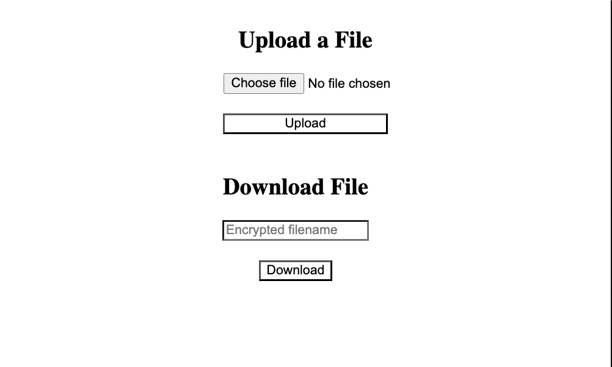

# Secure File Sharing System

A brief description of what this project does and who it's for.  
To build a file sharing system that allows users to upload and download files safely using AES encryption to protect files both during storage and transfer.


## Tech Stack

**Server:** Node, Express


## Installation
Make sure to install node in your system by following correct OS method

```bash
  https://www.geeksforgeeks.org/node-js/node-js-introduction/
```

## Environment Variables
To run this project, you will need to add the following environment variables to your .env file

`PORT`: available port on which you want to run the server (5000)

`ENCRYPTION_PASSWORD`: some secure key

## Run Locally

Clone the project

```bash
  git clone https://github.com/klvp/file-sharing-system.git
```

Go to the project directory

```bash
  cd file-sharing-system
```

Install dependencies

```bash
  npm install
```

Start the server

```bash
  npm run dev
```

Server is running on port 5000

```bash
  http://localhost:5000
```


## API Reference

#### upload file

```http
  POST /files/upload
```

#### Get item

```http
  GET /files/download/:filename
```

| Parameter | Type     | Description                       |
| :-------- | :------- | :-------------------------------- |
| `filename`      | `string` | **Required**. filename to fetch |


## 🛠 Demo


## Features

- Simple UI to upload and download files
- files are stored in server file system for simplicity
- upload files (pdf, txt, png) of less than 5MB
- store uploaded files in secure by encrypting
- download stored files by decrypting to original form
- Ensure upload and download files are intact by checking file hash


## Security Measures

- Limited file size to 5MB
- Limited file types to PDF, TXT and PNG
- Addes cors support so whitelisted domain can only be able to use routes
- Securely saved files by encrypting them
- While downloading decrypted to original format
- If file is tampared then then decrypt will fail
- Sanitizing the file name is an important step to prevent security risks
    - Directory traversal (../../etc/passwd)
    - Special characters causing shell injection or other issues
    - Overwriting files on disk
- Used helmet to set headers to avoid security risks
- Used rate limit to avoid overwelming servers with many requests and DDOS attacks

## Authors

- [@klvp](https://www.github.com/klvp)


## 🛠 Skills
Javascript, HTML, CSS, React, Next, Redux Toolkit, Node, Express, MongoDB, Elasticsearch, SQL, Redis, Docker, GraphQL ...
